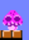

# 1. Author info
- name : Joowon Kim
- ID : 20200150
- Email : taeng31@kaist.ac.kr

# 2. URL of the git repository
-  https://github.com/joowonkime/Mario-fan-game

# 3. Youtube Video Link

# 4. Explanation of Game

This game is a 2-player game where you push your opponent out of the map with various attacks and the last player alive wins.
Player 1 is Mario and can move with the arrow keys, throw a fireball with the [ key, and throw a bomb with the ] key.
Player 2 is Luigi and can move with the wasd key, throw a fireball with the t key, and throw a bomb with the y key.
A player's death count can only be reduced by being pushed out of the map. Each player can use various attacks to push the opponent out of the map.
- A player can shoot a fireball and push the opponent out if it hits the opponent in a straight line.
- A player can throw a bomb to send the opponent flying farther and destroy some blocks. The longer you charge the bomb, the farther it flies. The player starts with 5 bombs.
- A player can shoot a missile by charging the bomb key for more than 1 second. The huge missile slowly moves forward and pushes the player it touches all the way. This missile can also be climbed on top. However, this missile is filled by one every time you eat three items.

Also, for the variety of the game, items are dropped at random locations at regular intervals. Each item has the following types.

- **mush**: The player who gets this will have their fireball abilities strengthened for a certain period of time, knocking back opponents twice as far.

- **poison**: The player who gets this will be poisoned and stuck in place. While stuck, they will not be knocked back at all and cannot move. However, they can be pushed back by missiles.

- **giant**: The player who gets this will double in size. The larger player's fireball size will be doubled, and they will only be pushed back by half of the opponent's knockback attacks.

- **bombadd**: 5 bombs are added.

The player starts with a total of 5 death counts, and the game is to survive by pushing away the opponents using the above methods.

# 5. Code Explanation
This game is based on p5.js.

The entire code can be broken down into the following major components:

Downloading image and music assets

Creating the background and map

Implementing the Player class

Attack object system

Item interactions

## 🎨 1. Image Sprites
All sprite assets came from:
👉 https://www.spriters-resource.com/nintendo_switch/K.html

The downloaded Mario sprite sheets are handled in imageAsset.js via the following steps:

preloadAssets: Loads the sprite sheet using loadImage.

sliceAssets: Extracts specific regions (using pixel coordinates and sizes) using createImage. Includes sprites for player states, items, and objects.

applyChromakey: Removes the shared background color from the sprites to make them transparent using a chroma key approach.

## 🎵 1-1. Music Assets
All music assets came from:
👉 https://downloads.khinsider.com/game-soundtracks/album/super-mario-bros

All sound effects and background music are handled through soundAsset.js.

## 🌄 2. Map and Background
The map and background are generated in sketch.js during setup() using assets from ImageAsset.js.

Background Class
Repeats a background image across the screen.

Pressing the spacebar changes the background theme (aesthetic only).

Map Structure
Generated from a predefined mapLayout.

Uses two block types: groundBlock and breakableBlock.

Managed by the Tile class.

Tile Class
Represents a 32×32 tile placed using constructor(x, y, type).

collides() detects collision with the player.

Tile.type is checked in bomb.explode() to decide if a block can break.

If a block breaks, BreakEffect triggers a short animation.

## 📦 2-1. Global Object Arrays
Repeatedly created objects are managed via global arrays:

let tiles = [], decoTiles = [];

let projectiles = [], specialProjectiles = [], bombs = [];

let breakEffects = [];

let items = [];

And each global variable has a function that manages it.
#### handleProjectiles()
#### handleBombs()
#### handleSpecialProjectiles()
-> These three functions commonly track the interaction between each object and player through update([player1, player2]), and check destroy() to remove the object when it needs to be removed through splice(i, 1).
#### breakManager()
-> When a block explodes due to a bomb, the breakeffect is stored in the breakeffects array, and after this animation is over, it removes the breakeffect from the breakEffects array.
#### randomSpawnItem()
-> Randomly spawns and drops a random type of item at a random x-coordinate every 10~14 seconds.

## 🧍 3. Player Class
The Player class manages all player behavior and interactions. Below is a breakdown of its core structure and methods.

### Constructor
constructor(x, y, imgSet, controls)
Initializes player with the following:

x, y: **Position**

vx, vy: **Movement velocities**

knockbackVX: **Knockback velocity**

width, height: **Size**

onGround: **Boolean to check ground contact**

jumpCount: **Counts number of jumps**

imgSet: **Assigned sprite set**

controls, keys: Input key mapping & tracking

bombHoldStartTime, chargeTime, maxCharge: Charge system for bombs

facing, state, frame: **For sprite control and animation**

_animTimer, _animInterval: **Timing helper for walking animation**

attackTimer: **Prevents rapid re-attacks**

dropping, dropRowY, currentTileY  : **Drop-through tile logic**

itemCount, bombCount, bigMissileCount: **Player resources**

fireTimer, poisonTimer, giantTimer: **Status effect durations**

deathCount: **Lives remaining**

### update()
Called every frame to update player state:

Updates status effect timers (fireTimer, poisonTimer, giantTimer).

Decreases attackTimer. When it reaches 0, switches animation state to 'idle' or 'jump'.

If the bomb key is held, updates chargeTime up to maxCharge.

Responds to left/right movement inputs and adjusts facing direction.

Applies gravity and updates vertical position.

Checks collision with tiles to determine whether the player is on the ground.

Uses landed flag to distinguish whether the player just landed this frame (vs onGround which tracks ongoing contact).

Implements drop-through logic: pressing down allows the player to fall through tiles. Uses dropRowY and currentTileY to prevent re-dropping the same tile.

Applies friction to knockbackVX.

If the player falls below deathZoneY, calls respawn().

### applyItem()
Called when the player picks up an item.

Increments itemCount and applies the corresponding status effect by resetting its timer.

### respawn()
Plays a death sound.

deathcount--

If the player has lives remaining, respawns them at the top of the screen.

If no lives remain, ends the game(gameOver flag = true) and declares the other player as the winner.

### jump()
Increments jumpCount and applies upward velocity.

### shoot()
Fires a fireball when the fire key is pressed:

Adds a new Projectile to projectiles

Triggers attack animation

Applies slight knockback to the player

### dropBomb()
Launches a bomb when triggered:

Adds a new Bomb to bombs

Plays attack animation

Bomb’s velocity is based on chargeTime

### fireBigMissile()
Fires a large missile:

Adds a BigMissile to specialProjectiles

Plays attack animation

Applies stronger knockback to the player

### handleKeyPressed() and handleKeyReleased()
Handles jump and fire inside handleKeyPressed().

Bomb behavior is split:

handleKeyPressed() sets bombHoldStartTime

handleKeyReleased() checks chargeTime and determines whether to throw a bomb or fire a missile.

### draw()
Draws the charge gauge above the player’s head.

Flips sprite based on facing.

Adds visual poison effect when poisonTimer is active.

Changes sprite frame based on state and frame to animate character behavior.

# 💥 4. Attack Object
This game features three types of attack-related classes: Projectile, Bomb, and BigMissile.

🚀 Projectile Class
#### constructor()
Determines the size based on two flags:

enchanted: whether the firing player had consumed a "mushroom" item.

isGiant: whether the player had consumed a "giant" item.

Spawns the projectile at a given (x, y) position.

Sets spawnTime and a lifeTime of 10 seconds.

#### update()
The projectile moves forward in a straight line.

If it hits a player, the shouldDestroy flag is set to true to allow removal.

#### draw()
Renders the fire sprite on screen.

#### destroy()
Returns the shouldDestroy flag to signal if the projectile should be removed.

#### hits()
Returns true if the projectile intersects with a player.

💣 Bomb Class
#### constructor(x, y, vx, vy)
Initializes the bomb with position and velocity:

this.x = x; this.y = y;

this.vx = vx; this.vy = vy;

this.width = 32; this.height = 32;

this.timer = 120;

this.explodeTimer = 15;

this.exploded = false; : **Flag to check if bomb has exploded**

this.warning = false; : **Flag to show warning before explosion**

this.shouldRemove = false;

this.radius = 100;

this.stuck = false; : **Flag to check if bomb is stuck on a tile**

this.stuckY = null;

#### update()
Updates the bomb's position while it bounces (with gravity and dampening: this.vy *= -0.5; this.vx *= 0.7).

After 1 second: warning = true

After 2 seconds: exploded = true, and explode() is triggered.

#### explode()
Applies knockback to all players within the blast radius, scaled based on their distance and item status.

Breakable blocks within the radius are destroyed with a break animation via breakEffects.push().

#### draw()
Displays the bomb with different sprites depending on state: normal, warning, or exploding.

#### destroy()
Returns the shouldDestroy flag to indicate if the bomb should be removed.

🛰️ BigMissile Class
#### constructor()
Creates a missile object at a given location with a lifeTime of 20 seconds.

#### update()
If a player collides horizontally with the missile, they are pushed along the missile's direction.

If a player collides vertically, they can stand on top of the missile like a platform.

Collision detection is handled by hits().

#### hits()
Returns true if the missile intersects with a player.

#### destroy()
Returns the shouldDestroy flag to indicate if the missile should be removed.

# 🎁 5. Items and Miscellaneous
### Item Class:
Functions similarly to other object classes. Items are spawned mid-air via randomSpawnItem() and fall due to gravity until they land on a tile.
Collision with the player is checked using the hits() method.
When picked up, the item's toRemove flag is set to true.

### drawUI():
Renders a UI panel on the bottom-left and bottom-right corners of the screen, showing each player's current status and resources.

### drawVictoryScreen():
When gameOver is true, a victory screen is displayed in the center of the canvas showing the winner’s sprite along with the text "YOU WIN!".
